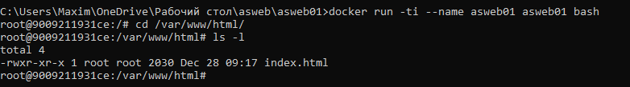

# Лабораторная работа №1. Контейнеризация, выполнил Rusnac Maxim IAFR2102ru

Данная лабораторная работа знакомит с основами контейнеризации и подготавливает рабочее место
для выполнения следующих лабораторных работ.

## Подготовка

Скачан и установлен [Docker Desktop](https://www.docker.com/products/docker-desktop/).

## Выполнение

Создана папка `asweb01`.

Создан файл`Dockerfile` со следующим содержимым:

```dockerfile
FROM debian:latest
COPY ./site/ /var/www/html/
CMD ["sh", "-c", "echo hello from $HOSTNAME"]
```

В папке asweb01 создана папка `site`. В новой папке создан файл `index.html` и заполнен html кодом.

## Запуск и тестирование

Открыт терминал в папке `asweb01` и выполнена команда:

```bash
docker build -t asweb01 .
```

_Сколько времени создавался образ?_

**Образ создавался примерно 8,5 секунд.
Внутрение процессы докера заняли 2,5 секунды.
Первый шаг из Dockerfile занял 5,9 секунд.
Второй шаг занял 0,1 секунду.**


Выполнена команда для запуска контейнера:

```bash
docker run --name asweb01 asweb01
```

_Что было выведено в консоли?_

**hello from d77f48dfced8**


Удален контейнер и запусщен снова:

```bash
docker rm asweb01
docker run -ti --name asweb01 asweb01 bash
```

В открывшемся окне выполнена команда:

```bash
cd /var/www/html/
ls -l
```

_Что выводится на экране?_
**На экране выводится список файлов в текущей дериктории**


Контейнер закрыт с использованием комманды `exit`.

