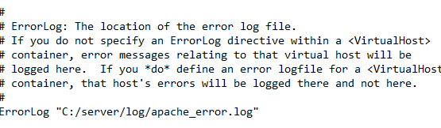
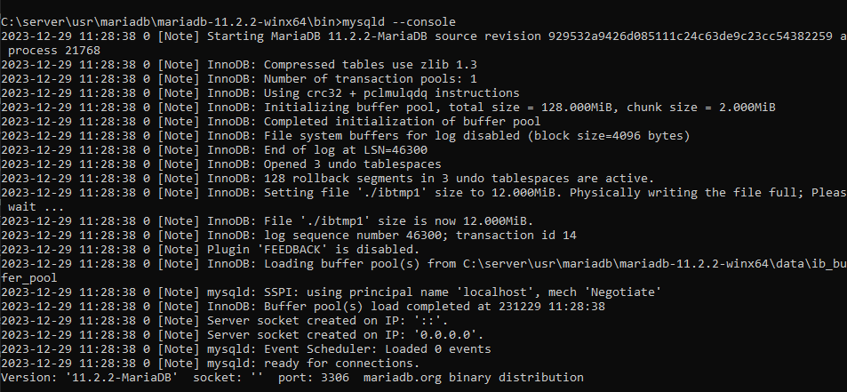

# Лабораторная работа № 2: Сборка Web сервера (WAMP)

Целью данной работы является ознакомление с устройством / принципами работы Web сервера Apache. Данную работу необходимо выполнять в OS Windows, работать с дистрибутивами, упакованными в архивы (__не инсталяторы!__).

## Подготовка

Скачайте последнюю доступные версии программ:

1. [__Apache HTTP Server__](https://httpd.apache.org) для Windows. Скачан apache для Windows из  [__Apache Lounge__](https://www.apachelounge.com/).
2. [__MariaDB Server__](https://mariadb.org/) для Windows - __ZIP__ файл.
3. [__интерпретатор языка PHP__](https://php.net) для Windows, ThreaSafe содержит нужный файл для apache

## Выполнение

На диске __С:__ (на диске __D:__) создайте директорию `server`, внутри которой создайте директории `www`, `tmp`, `usr`, `log`.


В директорию `usr` распакуйте скачаные архивы. Постарайтесь каждую программу расположить в своей папке, например, __Apache HTTP Server__ в папке `httpd`, __MariaDb Server__ в папке `mariadb`, __PHP__ в папке `php`.


В файле конфигурации WEB сервера (`httpd.conf`) подключите модуль взаимодействия с PHP. Данный модуль поставляется вместе с интерпретатором php (для php 7.x он называется `php7apache2_4.dll`). Настройте директорию сайта. Для этого установите параметры `DocumentRoot` и `Directory` равными `c:\server\www`.

**Дополнительные действия**

Указать правильный ServerRoot


Включить поддержку php интерпетатора


При указании localhost открывать index.php


В конфигурационном файле интерпретатора php (`php.ini`) подключите поддержку mysql (`php_mysqli`, `php_pdo_mysql`). Установите создание временных файлов в директорию `c:\server\tmp` (параметр `sys_temp_dir`).

**Дополнительные действия**
Переименовать php.ini-production в php.ini


Перенаправьте создание всех логов (apache, mysql, php) в директорию `c:\server\log`.

Apache:



Php:


mariadb:


Создайте в директории `c:\server\www` файл `index.php` со следующим содержимым:

```php
<?php phpinfo();
```

## Запуск и тестирование

Запустите сервер базы данных _MariaDb_. Для этого найдите в папке `c:\server\usr\mariadb\bin` файл `mysqld.exe` и запустите его. Подробнее [установка MariaDB](https://mariadb.com/kb/en/installing-mariadb-windows-zip-packages/).




Запустите _Apache HTTP Server_. Для этого найдите в папке `c:\server\usr\httpd\bin` файл `httpd.exe` и запустите его. 


Откройте в браузере URL `http://localhost`.


## Отчет

Предоставьте отчет о проделаной работе.

Ответьте на следующие вопросы
 
1. При открытии ссылки `http://localhost` в браузере отображается информация окружения интерпретатора PHP. Какую операционную систему указывает PHP?

2. В группе _Apache Environment_ (на той же странице) найдите переменную `HTTP_ACCEPT`. Чему равно её значение?

3. Сколько оперативной памяти выделяется под выполнение скрипта PHP (переменная `memory_limit` из группы _Core_)?

4. Существуют готовые сборки сервера Apache под Windows. Как они называются и в чем их особенности?

NIMP  

Компоненты в базовом пакете: NimpCP 2.4, Apache 2.2.17, Nginx 0.9.3, MySQL 5.5.8, PHP 5.3.5, Sendmail 31, phpMyAdmin 3.3.9, Sypex Dumper 2.0.8, FileZilla 0.9.37 beta, Memcached 1.2.4, HostsCmd 1.2, OpenSSl 0.9.8

XAMPP 

Компоненты в базовом пакете: Apache, MySQL, PHP + PEAR, Perl, mod_php, mod_perl, mod_ssl, OpenSSL, phpMyAdmin, Webalizer, Mercury Mail Transport System for Win32 and NetWare Systems v3.32, Ming, FileZilla FTP Server, mcrypt, eAccelerator, SQLite, and WEB-DAV + mod_auth_mysql

 Denwer 
 
 Компоненты в базовом пакете: apache, php, mysql, phpmyadmin, miniperl, sendmail