# Лабораторная работа № 4: Обслуживание сервера

Целью данной работы является обучение обслуживанию Web серверов, работающих в контейнерах.

> В производстве создание резервных копий часто выполняется специализированными средствами, в данной же работы рассматривается работа менеджера задач __cron__.

> Для облегчения сбора журналов стандартной практикой является переадресация логов в стандартные потоки __STDOUT__ и __STDERR__.

## Подготовка

Работа выполняется на базе результата Л.Р. №3.

Проверьте, что у вас установлен и запущен _Docker Desktop_.

Создайте папку `asweb04`. В ней будет выполняться вся работа.

Скопируйте в папку `asweb04` содержимое папки `asweb03`.

Лабораторная работа выполняется при подключении к сети Internet, так как скачиваются образы из репозитория https://hub.docker.com

## Выполнение

Для резервного копирования будем использовать контейнер _cron_, который:

1. каждые 24 часа создаёт резервную копию базы данных CMS;
2. каждый понедельник создаётся резервная копия директории CMS;
3. Каждые 24 часа удаляет резервные копии, которые были созданы 30 дней назад.
4. Каждую минуту в лог пишет сообщение _alive, \<username\>_.

Для этого в папке `./files/` создайте папку `cron`. В папке `./files/cron/` создайте папку `scripts`. В корневом каталоге создайте папку `backups`, а в ней `mysql`, `site`.

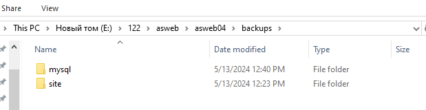
### сообщение о статусе

В папке `./files/cron/scripts/` создайте файл `01_alive.sh` со следующим содержимым:

```shell
#!/bin/sh

echo "alive ${USERNAME}" > /proc/1/fd/1
```

Данный скрипт выдает сообщение `alive ${USERNAME}`.

### резервное копирование сайта

В папке `./files/cron/scripts/` создайте файл `02_backupsite.sh` со следующим содержимым:

```shell
#!/bin/sh

echo "[backup] create site backup" \
    > /proc/1/fd/1 \
    2> /proc/1/fd/2
tar czfv /var/backups/site/www_$(date +\%Y\%m\%d).tar.gz /var/www/html
echo "[backup] site backup done" \
    >/proc/1/fd/1 \
    2> /proc/1/fd/2
```

Данный скрипт выдает архивирует папку `/var/www/html` и сохраняет архив в `/var/backups/site/`.

### резервное копирование базы данных

В папке `./files/cron/scripts/` создайте файл `03_mysqldump.sh` со следующим содержимым:

```shell
#!/bin/sh

echo "[backup] create mysql dump of ${MARIADB_DATABASE} database" \
    > /proc/1/fd/1
mysqldump -u ${MARIADB_USER} --password=${MARIADB_PASSWORD} -v -h mariadb ${MARIADB_DATABASE} \
    | gzip -c > /var/backups/mysql/${MARIADB_DATABASE}_$(date +\%F_\%T).sql.gz 2> /proc/1/fd/1
echo "[backup] sql dump created" \
    > /proc/1/fd/1
```

### удаление старых файлов

В папке `./files/cron/scripts/` создайте файл `04_clean.sh` со следующим содержимым:

```shell
#!/bin/sh

echo "[backup] remove old backups" \
    > /proc/1/fd/1 \
    2> /proc/1/fd/2
find /var/backups/mysql -type f -mtime +30 -delete \
    > /proc/1/fd/1 \
    2> /proc/1/fd/2
find /var/backups/site -type f -mtime +30 -delete \
    > /proc/1/fd/1 \
    2> /proc/1/fd/2
echo "[backup] done" \
    > /proc/1/fd/1 \
    2> /proc/1/fd/2
```

### подготовка cron

В папке `./files/cron/scripts/` создайте файл `environment.sh` со следующим содержимым:

```shell
#!/bin/sh

env >> /etc/environment

# execute CMD
echo "Start cron" >/proc/1/fd/1 2>/proc/1/fd/2
echo "$@"
exec "$@"
```
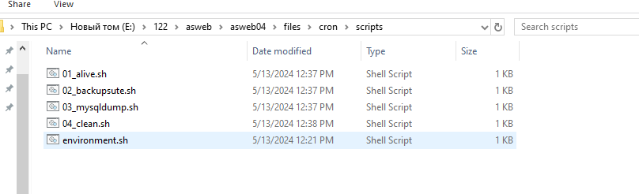

В папке `./files/cron/` создайте файл `crontab` со следующим содержимым:

```
# Example of job definition:
# .---------------- minute (0 - 59)
# |  .------------- hour (0 - 23)
# |  |  .---------- day of month (1 - 31)
# |  |  |  .------- month (1 - 12) OR jan,feb,mar,apr ...
# |  |  |  |  .---- day of week (0 - 6) (Sunday=0 or 7) OR sun,mon,tue,wed,thu,fri,sat
# |  |  |  |  |
# *  *  *  *  * user-name command to be executed
  *  *  *  *  * /scripts/01_alive.sh > /dev/null
  *  *  *  *  * /scripts/02_backupsite.sh > /dev/null
  *  *  *  *  * /scripts/03_mysqldump.sh > /dev/null
  *  *  *  *  * /scripts/04_clean.sh > /dev/null
# Don't remove the empty line at the end of this file. It is required to run the cron job
```
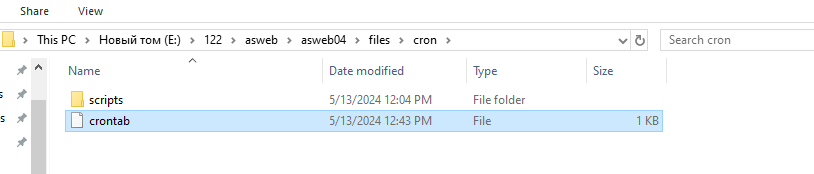
### создание контейнера cron

Создайте в корневом каталоге файл `Dockerfile.cron` со следующим содержимым:

```dockerfile
FROM debian:latest

RUN apt update && apt -y upgrade && apt install -y cron mariadb-client

COPY ./files/cron/crontab /etc/cron.d/crontab
COPY ./files/cron/scripts/ /scripts/

RUN crontab /etc/cron.d/crontab

ENTRYPOINT [ "/scripts/environment.sh" ]
CMD [ "cron", "-f" ]
```
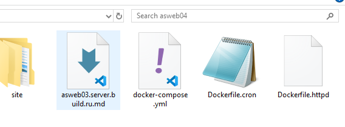

Отредактируйте файл `docker-compose.yml`, добавив после определения сервиса `mariadb` следующие строки:

```yaml
  cron:
    build:
      context: ./
      dockerfile: Dockerfile.cron
    environment:
      USERNAME: <nume prenume>
      MARIADB_DATABASE: sample
      MARIADB_USER: sampleuser
      MARIADB_PASSWORD: samplepassword
    volumes:
      - "./backups/:/var/backups/"
      - "./site/wordpress/:/var/www/html/"
    networks:
      - internal
```
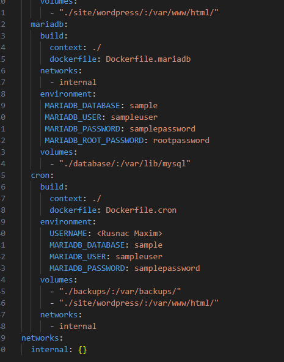

Замените `<nume prenume>` на Rusnac Maxim.

### Ротация логов

Обратите внимание, что сборка сервера на основе контейнеров выводит логи не в файлы, а в стандартный поток вывода.

Проверьте, проанализировав файл `./files/httpd/httpd.conf`, куда выводится журнал общего назначения Apache HTTP Server? А журнал ошибок?
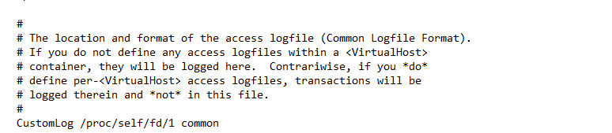
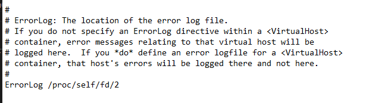
## Запуск и тестирование

Для построения проекта откройте командную строку и выполните в корневом каталоге команду

```shell
docker-compose build
```
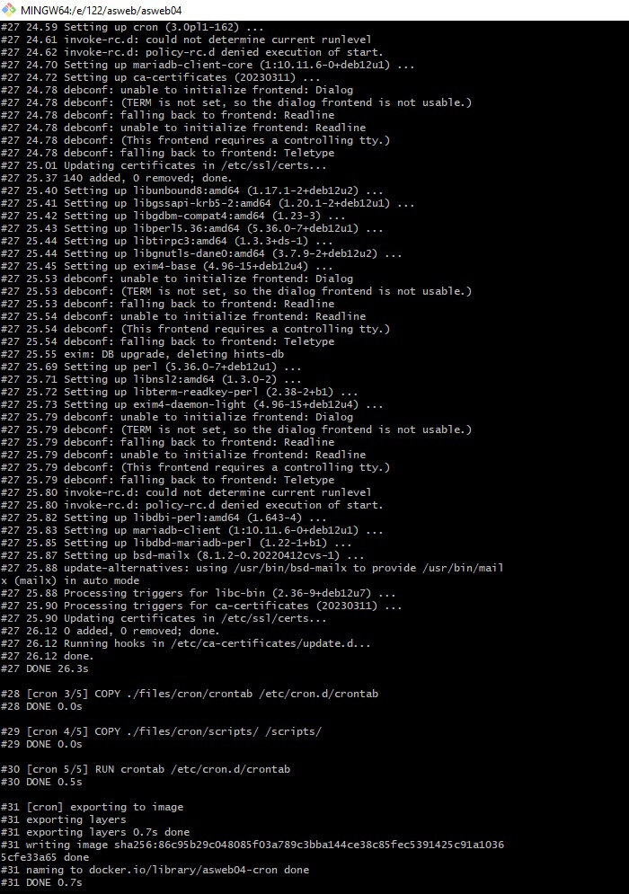

Запустите решение командой

```shell
docker-compose up -d
```
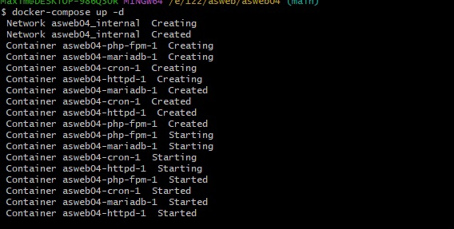

Прочите логи каждого контейнера. Для этого выполните команду

```shell
docker logs <container name>
```

Например, для созданного контейнера _cron_ логи можно прочитать следующей командой:

```shell
docker logs asweb04-cron-1
```
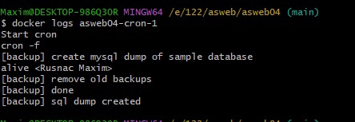
Подождите 2-3 минуты и проверьте, что находится в папках `./backups/mysql/`  и `./backups/site/`.
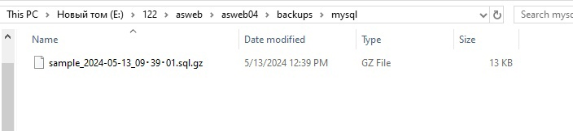
Остановите контейнеры и исправьте файл `./files/cron/crontab` таким образом, чтобы

1. каждые день в 1:00 создавалась резервная копия базы данных CMS;
2. каждый понедельник создавалась резервная копия директории CMS;
3. Каждые день в 2:00 удалялись резервные копии, которые были созданы 30 дней назад.

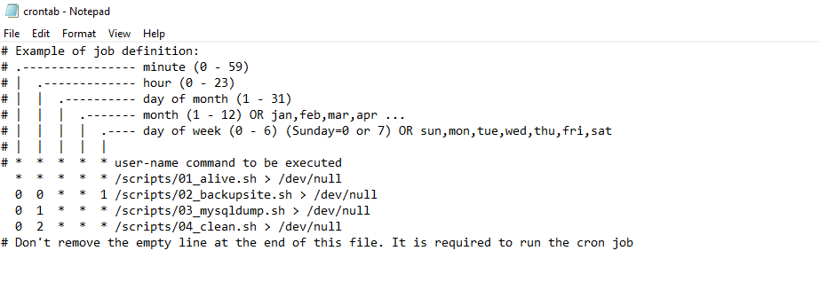
## Отчет

Предоставьте отчет о проделаной работе.

Ответьте на вопросы:

1. Зачем необходимо создавать пользователя системы для каждого сайта?

Создание отдельного пользователя для каждого сайта повышает безопасность системы. Если один сайт подвергнется атаке или компрометации, другие сайты, запущенные под разными пользователями, останутся недоступными для злоумышленников.

2. В каких случаях Web сервер должен иметь полный доступ к папкам (папке) сайта?

Web сервер должен иметь полный доступ к папкам сайта в случаях, когда требуется изменение файлов на сервере во время выполнения программы или скриптов на сервере. Например, если на сервере выполняются динамические скрипты, такие как PHP, которые должны создавать, изменять или удалять файлы на сервере.
3. Что означает команда `chmod -R 0755 /home/www/anydir`?

Команда `chmod -R 0755 /home/www/anydir` устанавливает права доступа к файлам и папкам в директории /home/www/anydir и всех её поддиректориях. Здесь:

* -R означает рекурсивное применение изменений ко всем файлам и поддиректориям.
* 0755 устанавливает права доступа к файлам в формате восьмеричных чисел. В данном случае: владелец имеет права на чтение, запись и выполнение , а группа и остальные пользователи имеют права на чтение и выполнение.
4. В скриптах shell каждая команда оканчивается строкой `> /proc/1/fd/1`. Что это означает?
В скриптах shell > /proc/1/fd/1 используется для перенаправления вывода скрипта в стандартный поток вывода процесса с PID 1. 

5. Возникшие проблемы: sh файлы не были найдены с ошибками в логах в cron_1 container.
  Решение: Поменять EOFL в crontab, *.sh файлов с CRLF на LF