# Лабораторная работа № 5: Элементы безопасности Web сервера

При использовании сайта на базе кластера контейнеров большая часть ответственности по безопасности ложится на плечи администратора облака. Однако, ряд шагов, необходимых для обеспечения безопасности (стабильности), должен выполнить разработчик (DevOps).

## Подготовка

Работа выполняется на базе результата Л.Р. №4.

Проверьте, что у вас установлен и запущен _Docker Desktop_.

Создайте папку `asweb05`. В ней будет выполняться вся работа.

Скопируйте в папку `asweb05` содержимое папки `asweb04`.

Лабораторная работа выполняется при подключении к сети Internet, так как скачиваются образы из репозитория https://hub.docker.com

## Выполнение

### поиск уязвимостей

Выполните сборку 

```shell
docker-compose build
```

Откройте __Docker Desktop__, перейдите во вкладку _Images_. Дайте поиск по слову _asweb05_ - в списке будет 4 образа. Просмотрите каждый образ: по нажатию на него запускается сканирование его на уязвимости.

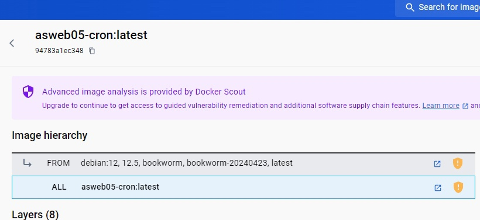
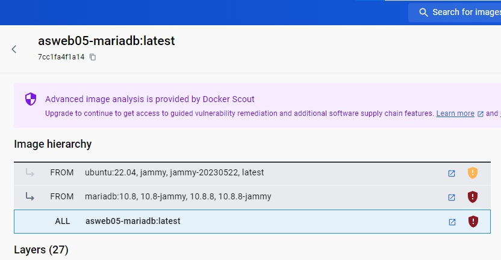
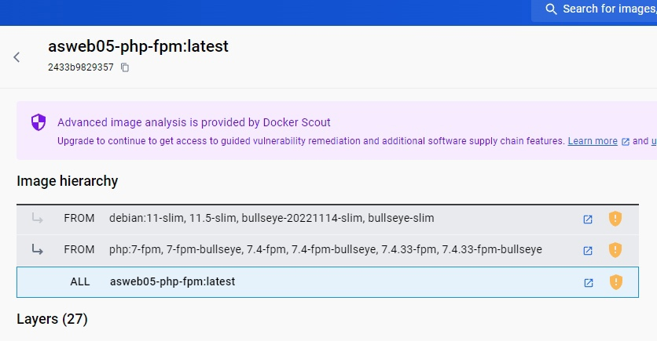
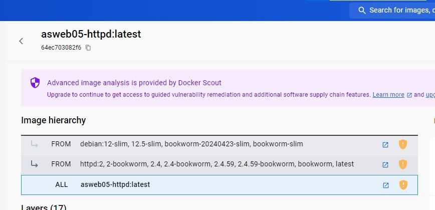
_В каких образах найдены уязвимости?_Во всех

В файле `Dockerfile.php-fpm` поменяйте первую строку на следующую:

```dockerfile
FROM php:8.1-fpm
```
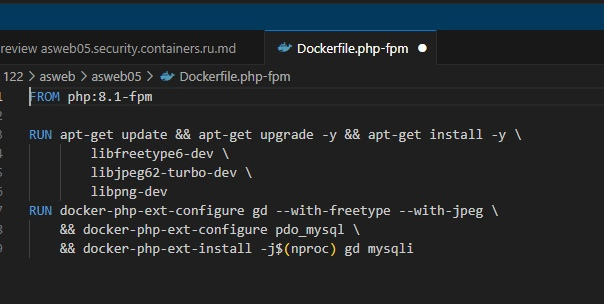

Пересоберите образы и снова проверьте контейнер php-fpm на уязвимости.
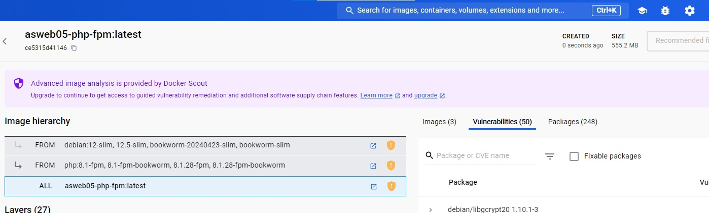
### ограничение ресурсов контейнера

В файле `docker-compose.yml` в описании сервиса `httpd` под ключом `build` добавьте следующий ключ:

```yaml
    deploy:
      resources:
        limits:
          cpus: "0.50"
          memory: 256M
        reservations:
          cpus: "0.25"
          memory: 128M
```

Таким образом ограничиваем потребление процессора и памяти сервисом `httpd`. Подобные ограничения пропишите для всех контейнеров.

### задание условий стабильности

Для обеспечения стабильности (restart policy) решения часто указывают правила перезагрузки контейнера.

Добавьте к определению `deploy` сервиса `httpd` следующий ключ:

```yaml
    deploy:
      ...
      restart_policy:
        condition: on-failure
        delay: 3s
        max_attempts: 5
        window: 60s
```

Добавьте подобные определения для всех сервисов.
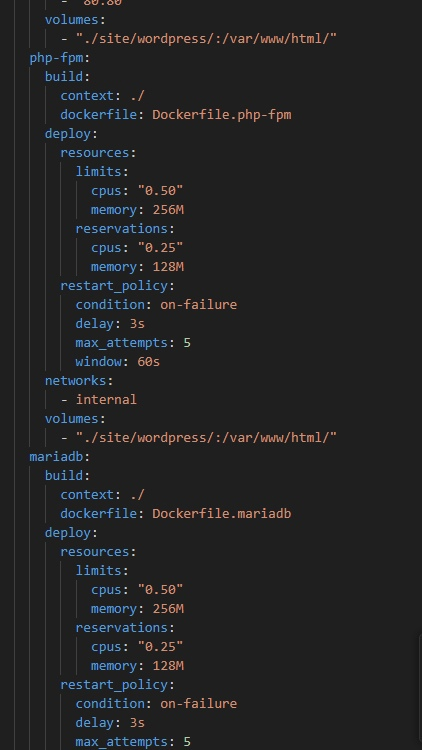
### уменьшение размера образа

Для уменьшения образов используются различные практики. В работе будем удалять следы после обновления пакетов.

В файле `Dockerfile.httpd` обновите вторую строку, записав её следующим образом:

```dockerfile
RUN apt update && apt upgrade -y \
	&& rm -rf /var/lib/apt/lists/*
```
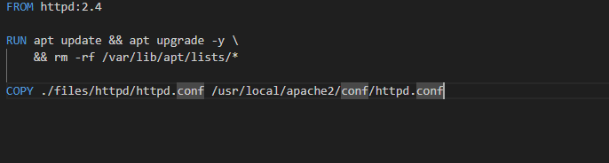
Добавленная команда удаляет скачаные списки из репозиториев. Добавьте её во все описания образов после команды обновления системы.

В файле `Dockerfile.cron` обновите вторую строку, записав её следующим образом:

```dockerfile
RUN apt update && apt -y upgrade \
	&& apt install -y cron mariadb-client --no-install-recommends \
	&& rm -rf /var/lib/apt/lists/*
```
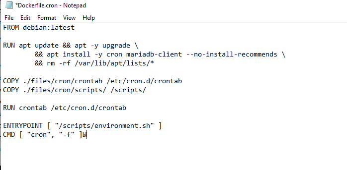
Ключ ` --no-install-recommends` запрещает команде `apt install` установку рекомендованных пакетов. Во всех описаниях образов, где встречается установка пакетов, добавьте данный ключ.
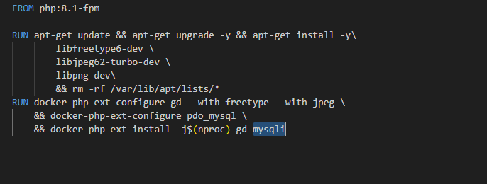
## Запуск и тестирование

Заново соберите и запустите проект. Проверьте как изменились размеры образов.
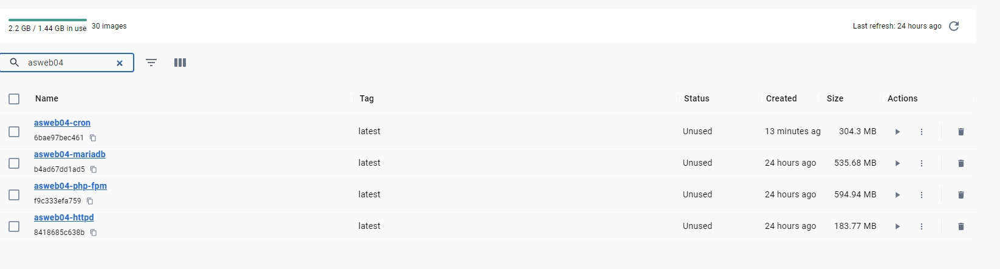
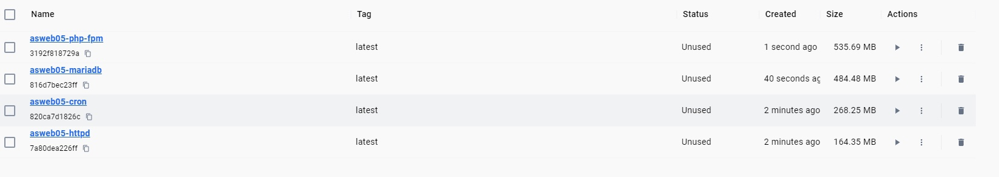
Образы уменьшились, кроме httpd
## Ответьте на вопросы:

1. Существуют ли ограничения для правил устойчивости (restart policy)?

* no: Это означает, что контейнер не будет перезапускаться автоматически независимо от причины его остановки. Это наиболее строгая политика и обычно используется для контейнеров, которые не должны автоматически восстанавливаться после сбоев.

* always: Это политика, при которой контейнер будет перезапущен автоматически в случае его остановки, будь то по причине ошибки, завершения работы или вручную.

* unless-stopped: Это аналогично политике always, но контейнер не будет перезапускаться, если он был остановлен вручную (например, с помощью docker stop), но будет перезапущен после перезапуска Docker или хостовой машины.

2. Какие еще существуют методы минимизации размеров образов?

* Использование базовых образов: Используйте наименьшие возможные базовые образы, такие как Alpine Linux, BusyBox или Scratch, которые содержат только минимальный набор компонентов, необходимых для работы вашего приложения.

* Оптимизация слоев образа: Структурируйте Docker-образы таким образом, чтобы часто изменяемые или обновляемые части были в отдельных слоях, а статические части, такие как зависимости и библиотеки, оставались в стабильных слоях. Это позволяет избежать пересоздания слоев образа, которые не изменились.

* Многоразовое использование кэша сборки: При использовании инструкции RUN в Dockerfile учитывайте порядок команд таким образом, чтобы максимально использовать кэш сборки Docker. Это может существенно снизить время сборки образа и его размер.

* Очистка временных файлов: Убедитесь, что все временные файлы, созданные в процессе сборки образа, удаляются после завершения этого этапа. Это позволит избежать лишнего увеличения размера образа.

* Минимизация установленных пакетов и зависимостей: Удаляйте ненужные зависимости и пакеты после установки приложения, чтобы уменьшить размер образа.

* Использование мультистадийных сборок: При необходимости выполнения различных этапов сборки приложения в Docker-образе, используйте мультистадийные сборки Docker, чтобы избежать включения ненужных компонентов в конечный образ.

* Сжатие и уменьшение размера файлов: Используйте инструменты для сжатия и уменьшения размера файлов внутри образа, такие как gzip или bzip2, чтобы уменьшить общий размер образа.